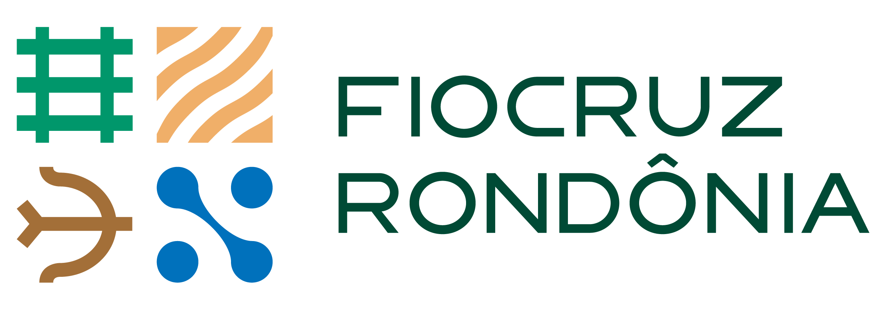

<a href="https://www.rondonia.fiocruz.br/laboratorios/bioinformatica-e-quimica-medicinal/" target="_blank">
    
</a>

<div style="text-align: center">
    <p style="font-size: 30px; line-height: 30px;">Visual Dynamics</p>
    <p style="font-size: 20px; line-height: 20px;">A web platform to perform molecular dynamics</p>
</div>

#
Visual Dynamics is a web platform that automates the generation and execution of molecular dynamics with GROMACS and provides graphical outputs of said dynamic.

## Installation
As a web service that can be accessed at any time [here](http://visualdynamics.fiocruz.br/), you probably will only need to install it from scratch if you want to contribute or to self-host it, for that, we got you covered.

### For Arch Linux and variants:
We completely automated the installation process for Arch, just clone the repository and run the install
```zsh
git clone git@github.com:LABIOQUIM/visualdynamics.git
cd visualdynamics
./install.sh
```
This should be enough to get you started on Arch.

### For Debian Linux and variants:
Unlike Arch, we don't provide an automated installation for Debian and variants (like Ubuntu), but we do provide an easy to undestand tutorial to get started.  
We'll start by updating our system and then install Grace and FFTW3:
```zsh
sudo apt-get update
sudo apt-get install grace fftw3
```

With Grace installed, we'll move on to compile and install GROMACS 2021.4  
If you prefer reading the official documentation, you can head [here](https://manual.gromacs.org/documentation/2021.4/install-guide/index.html)
```zsh
curl https://ftp.gromacs.org/gromacs/gromacs-2021.4.tar.gz --output gromacs-20214.tar.gz
tar xfz gromacs-2021.4.tar.gz
cd gromacs-2021.4
mkdir build
cd build
cmake .. -DGMX_BUILD_OWN_FFTW=OFF -DREGRESSIONTEST_DOWNLOAD=ON
make
make check
sudo make install
source /usr/local/gromacs/bin/GMXRC
```
This should suffice to get your GROMACS up and running.  
With both our dependencies installed, we can then clone the repository and start our service
```sh
git clone git@github.com:LABIOQUIM/visualdynamics.git
cd visualdynamics
./install.sh
```
When the installation ends you can just run `./run.sh` and the service will start, by default it will be accessible at `localhost:5000`.  
There'll be a file named `login.txt` that contains your generated admin user and password.

## License
The Visual Dynamics source code is available under the [MIT License](./LICENSE). Some of the dependencies are licensed differently, so watch out for them.